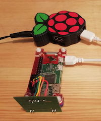

# SL030
A driver package for the SL030 RFID tag reader.

For use with SKPang Electronics SL030 RFID module,
with a SL030 Raspberry Pi cable, and any model Raspberry Pi,
product numbers: RFID-SL030, RSP-SL030-CAB

[SKPang product info](http://skpang.co.uk/blog/archives/946)



Works on all Pi models, with Python2 and Python3.

## Using the Example Program

This package is designed to be zero-install (i.e. you can copy it onto your Pi
from a USB memory stick, not need to fiddle with any system settings, run it
and it will work). This is specifically to make it easier to use this as a
building block for projects in school STEM clubs, where we rarely have internet
access.

Run the example as follows:

```
   python rfid_example.py
```

or

```
    python3 rfid_example.py
```

Then bring a tag close to the reader, and you should see it's ID number
displayed on the console. The red light on the front of the reader board
also lights when it detects a tag.

You can use any mifare tag - such as an oyster card, an NFC enabled credit
or debit card, and many sticky labels and key fobs that are advertised as
'Mifare compatible' (13.56MHz tags). This does NOT include hitag tags,
so make sure you get the right tag before you use this card.

The driver only supports the 'read id' method of the card, as that is the
most common use case, and what I needed for the projects that I was building
at the time. The Mifare standard does support readable and writeable
memory locations on cards that have memory, and other secure key transactions.


## Notes

1. The 20/08/2020 build of RaspberryPi OS Lite doesn't have RPi.GPIO installed
for Python3 (does for Python2). You can install it manually though: 
[instructions here](https://github.com/whaleygeek/SL030/issues/1#issuecomment-728889189)

2. On older Pi OS's you will have to prefix commands with sudo to run as root to get
access to the GPIOs, but all newer OS's support the gpiomem device node where you no 
longer need to be running as root. The embedded gpio driver automatically notices 
the existence of /dev/gpiomem and uses it if it can; it falls back to /dev/mem if 
it can't access it. 

3. The driver will read it's necessary system configuration addresses from the
OS device tree in '/proc/device-tree/soc/ranges' if possible, which makes it
work on any OS version. If this device tree doesn't exist, it falls back to the
default base address of the original PiBv1 - so this should allow it to work 
out of the box with no fiddling on any OS no matter how old or how new.

4. The code works in both Python2 and Python3, but I'll generally only be
testing against Python3 in the future from now on.

5. Because this driver is zero-install, and avoids any fiddling with
system settings or installation of other packages, it has an embedded
I2C driver of it's own. I2C is usually OFF by default when the OS is
first installed, but if you turned the I2C support on it might stop
the embedded I2C driver from working as the pins will be in-use by the
kernel. Turn off I2C driver support in raspi-config.

6. Because this uses an embedded I2C driver, you can re-map the pins
to pretty much any GPIO pins on the Pi GPIO header - change the mapping
in file i2c.c 
[here](https://github.com/whaleygeek/SL030/blob/master/src/rfid/ci2c/i2c.c#L54)
and the CARD_PRESENT is changeable in file __init__.py
[here](https://github.com/whaleygeek/SL030/blob/master/src/rfid/__init__.py#L19)

7. There are various config options in __init__.py, if you know what you are
doing you might find them useful.

Last tested 17/11/2020

@whaleygeek

17 Nov 2020
